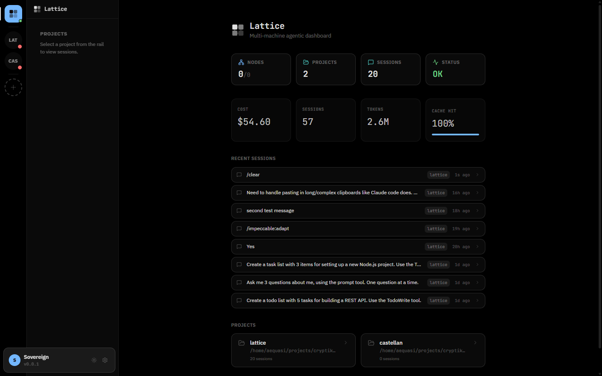
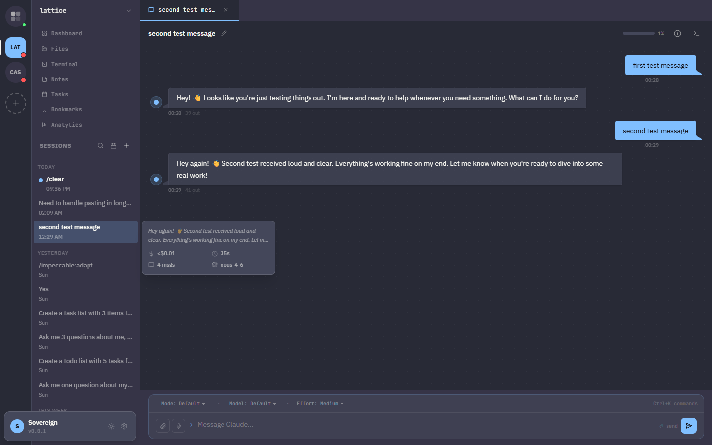
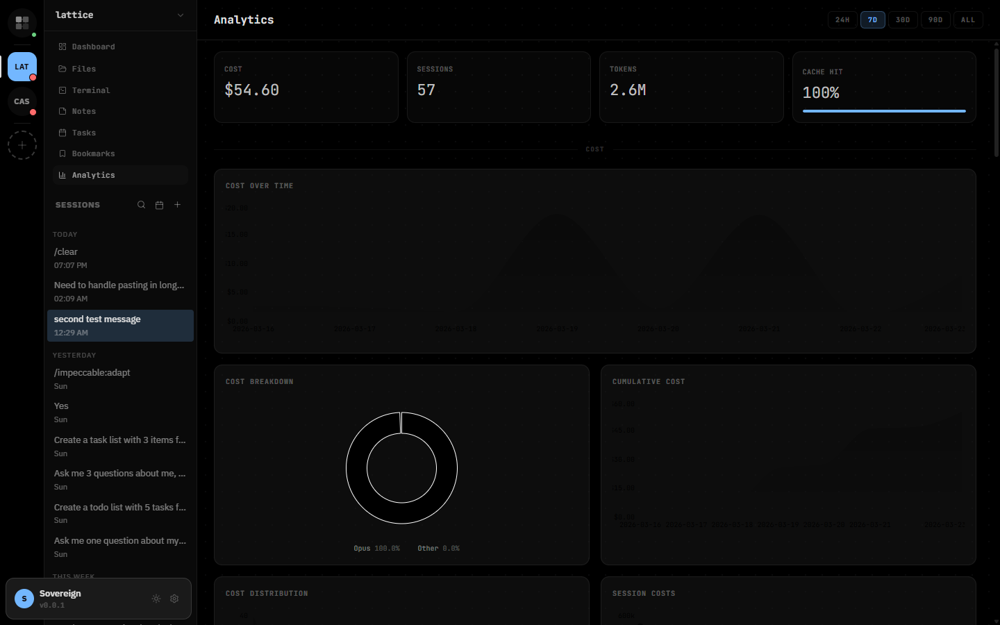
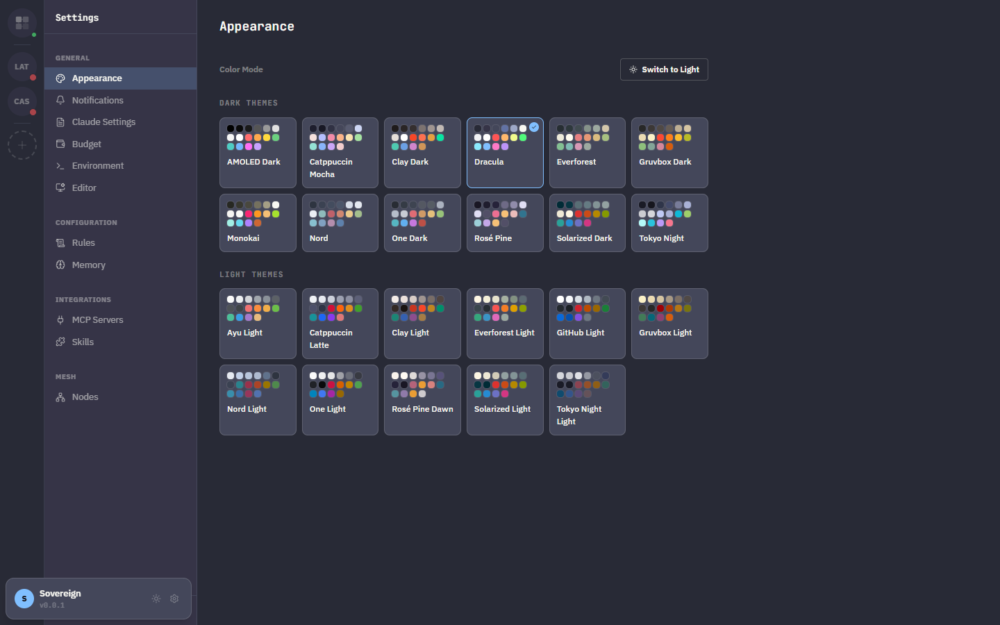
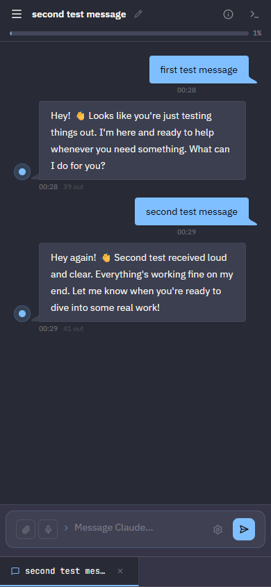

# Lattice

Multi-machine agentic dashboard for Claude Code. Monitor sessions, manage projects, track costs, and orchestrate across mesh-networked nodes.

> **Alpha** — Lattice is under active development. APIs and features may change.



## What is Lattice?

Lattice is a web dashboard that sits alongside your Claude Code sessions. It gives you a unified view across projects, machines, and sessions — with real-time monitoring, cost tracking, and configuration management.

### Core Features

- **Multi-project dashboard** — Fleet overview with node status, session counts, cost stats, and recent activity across all projects
- **Real-time chat** — Send messages, approve tool use, monitor context window usage and costs with per-message token counts
- **Session management** — Browse, rename, delete, search, and resume sessions with date range filtering and hover previews
- **Analytics** — Cost over time, token flow, cache efficiency, session complexity, activity calendar, and 15+ chart types
- **Cost budget** — Daily spend tracking with configurable enforcement (warning, confirm, or hard block)
- **Theme system** — 23 base16 themes (12 dark, 11 light) with OKLCH color space for perceptual consistency



### Productivity

- **Session tabs** — Open multiple sessions as tabs, switch between them, split-pane via right-click
- **Message bookmarks** — Pin important messages, jump between bookmarks, global bookmarks view across all sessions
- **Keyboard shortcuts** — Press `?` to see all shortcuts, `Ctrl+K` for command palette
- **Message actions** — Copy messages (raw markdown or plain text), start new sessions from any message
- **Auto-titling** — Sessions automatically get descriptive titles from the first exchange
- **Session hover previews** — Hover any session to see cost, duration, message count, model, and last message



### Infrastructure

- **MCP server management** — Add, edit, and remove MCP servers at global or project level
- **Skill marketplace** — Search and install skills from [skills.sh](https://skills.sh)
- **Mesh networking** — Connect multiple machines, proxy sessions across nodes with automatic discovery
- **Configuration editor** — Edit CLAUDE.md, environment variables, rules, and permissions through the UI
- **Memory management** — View and edit Claude's project memories with frontmatter metadata



### Mobile Support

Responsive design with touch targets, swipe-to-open sidebar, and optimized layouts for mobile devices.



## Quick Start

### Install

```bash
# With npm
npm install -g lattice-ai

# With bun
bun install -g lattice-ai
```

### Run

```bash
lattice
```

Opens the dashboard at `http://localhost:7654`. Add projects through the UI or by navigating to a directory with a `CLAUDE.md` file.

### Development

```bash
git clone https://github.com/cryptiklemur/lattice.git
cd lattice
bun install
bun run dev
```

The dev server hot-reloads both the Bun server and the Vite client automatically.

## Architecture

Lattice is a Bun monorepo with three packages:

| Package | Description |
|---------|------------|
| `shared/` | TypeScript types, message protocol definitions, constants |
| `server/` | Bun WebSocket server — session management, analytics engine, mesh networking, structured logging |
| `client/` | React 19 + Vite + Tailwind + daisyUI — UI components, state management, 23 themes |

The server communicates with clients via WebSocket using a typed message protocol defined in `shared/`. Sessions are managed through the [Claude Agent SDK](https://github.com/anthropics/claude-agent-sdk). The client uses Tanstack Store for state and Tanstack Router for routing.

### Security

- Authentication via passphrase with scrypt hashing and 24-hour token expiration
- Per-client WebSocket rate limiting (100 messages per 10-second window)
- Attachment upload size limits (10MB max)
- Bash `cd` commands boundary-checked against project directory
- Mesh pairing tokens expire after 5 minutes
- Graceful server shutdown with active stream draining

### Testing

Playwright test suite covering onboarding, session flow, keyboard shortcuts, accessibility, message actions, and session previews.

```bash
# Start the server first
bun run dev

# Run tests
bunx playwright test

# Single test file
bunx playwright test tests/session-flow.spec.ts
```

## Configuration

Lattice stores its config at `~/.lattice/config.json`. Global Claude settings are read from `~/.claude/` and `~/.claude.json`.

| Path | Purpose |
|------|---------|
| `~/.lattice/config.json` | Daemon config (port, name, TLS, projects, cost budget) |
| `~/.lattice/bookmarks.json` | Message bookmarks across all sessions |
| `~/.claude/CLAUDE.md` | Global Claude instructions |
| `~/.claude.json` | Global MCP server configuration |
| `~/.claude/skills/` | Global skills directory |

Project-level settings are stored in each project's `.claude/` directory and `.mcp.json`.

### Environment

- `ANTHROPIC_API_KEY` — Optional. Server uses the token from `claude setup-token` if not set.
- `DEBUG=lattice:*` — Enable structured debug logging (namespaces: server, ws, chat, session, mesh, auth, fs, analytics)
- Server binds to `0.0.0.0:7654` by default. Override with `lattice --port <port>`.

## Contributing

See [CONTRIBUTING.md](CONTRIBUTING.md) for development setup, coding standards, and pull request guidelines.

## License

[MIT](LICENSE)
