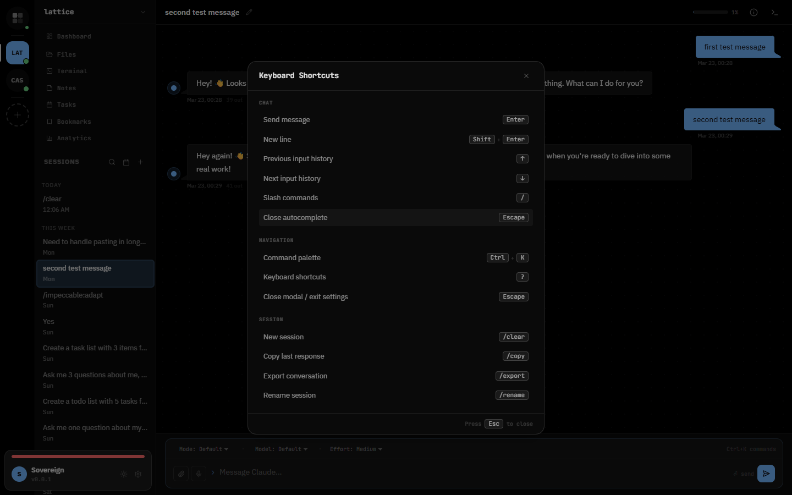

<p align="center">
  
</p>

<h1 align="center">Lattice</h1>

<p align="center">
  Multi-machine agentic dashboard for Claude Code.<br/>
  Monitor sessions, manage projects, track costs, and orchestrate across mesh-networked nodes.
</p>

<p align="center">
  <a href="https://www.npmjs.com/package/@cryptiklemur/lattice"></a>
  <a href="https://github.com/cryptiklemur/lattice/actions"></a>
  <a href="https://github.com/cryptiklemur/lattice/blob/main/LICENSE"></a>
  <a href="https://github.com/cryptiklemur/lattice"></a>
</p>

> **Alpha** — Lattice is under active development. APIs and features may change.

---

## Quick Start

```bash
npm install -g @cryptiklemur/lattice
lattice
```

Opens at `http://localhost:7654`.

<details>
<summary>Development setup</summary>

```bash
git clone https://github.com/cryptiklemur/lattice.git
cd lattice
npm install
npm run dev
```

Starts Express + Vite on a single port (`http://localhost:7654`) with HMR.

</details>

<details>
<summary>Updating</summary>

```bash
lattice update
```

The server also checks for updates automatically and shows a banner in the UI when a new version is available.

</details>

---

## Features

### Chat & Sessions

Send messages, approve tool use, and monitor context window usage with per-message token counts. Browse, rename, delete, and search sessions with date range filtering and hover previews. Sessions automatically get descriptive titles from the first exchange.


### Analytics & Cost Tracking

Track spending, token usage, cache efficiency, and session patterns with 15+ chart types. Set daily cost budgets with configurable enforcement (warning, confirm, or hard block).


### Workspace

Open multiple sessions as tabs and switch between them. Split-pane via right-click context menu. Pin important messages with bookmarks — jump between them per-session or browse the global bookmarks view. Per-project tab state persists across navigation.

Press `?` for keyboard shortcuts, `Ctrl+K` for the command palette.



### Themes & Settings

23 base16 themes (12 dark, 11 light) with OKLCH color space. Configure MCP servers, environment variables, rules, permissions, and Claude settings through the UI.


### Plugin Management

Install, update, and remove Claude Code plugins from the UI. Browse all plugins across registered marketplaces sorted by popularity, view details (skills, hooks, rules, author info), and enable/disable plugins per project.

### Infrastructure

- **Mesh networking** — Connect multiple machines with automatic discovery and session proxying
- **MCP servers** — Add, edit, and remove at global or project level
- **Plugins & skills** — Browse marketplaces, install plugins, manage per-project
- **Memory management** — View and edit Claude's project memories
- **Self-updating** — Automatic update checks with in-app banner and `lattice update` CLI

### Mobile

Responsive design with touch targets, swipe-to-open sidebar, and optimized layouts.


---

## Architecture

Single npm package with three source directories:

| Directory | Stack |
|-----------|-------|
| `src/shared/` | TypeScript types, message protocol, constants |
| `src/server/` | Express + ws server, analytics engine, mesh networking |
| `src/client/` | React 19, Vite, Tailwind, daisyUI, 23 themes |

In development, Vite runs in middleware mode inside Express — single port for API, WebSocket, and HMR. In production, Express serves the built client from `dist/client/`.

Communication via typed WebSocket messages. Sessions managed through the [Claude Agent SDK](https://github.com/anthropics/claude-agent-sdk). Client state via Tanstack Store + Router.

### Security

| Feature | Detail |
|---------|--------|
| Authentication | Passphrase with scrypt hashing, 24-hour token expiration |
| Rate limiting | 100 messages per 10-second window per client |
| Attachments | 10MB upload limit |
| Bash commands | `cd` boundary-checked against project directory |
| Mesh pairing | Tokens expire after 5 minutes |
| Shutdown | Graceful drain of active streams |

### Testing

```bash
npm run dev            # start server
npx playwright test    # run tests
```

Playwright suite covers onboarding, session flow, keyboard shortcuts, accessibility, message actions, and session previews.

## Configuration

| Path | Purpose |
|------|---------|
| `~/.lattice/config.json` | Daemon config (port, name, TLS, projects, cost budget) |
| `~/.lattice/bookmarks.json` | Message bookmarks across all sessions |
| `~/.claude/CLAUDE.md` | Global Claude instructions |
| `~/.claude.json` | Global MCP server configuration |

**Environment variables:**

- `ANTHROPIC_API_KEY` — Optional. Uses `claude setup-token` if not set.
- `DEBUG=lattice:*` — Structured debug logging.
- Server binds to `0.0.0.0:7654`. Override with `lattice --port <port>`.

## Running with systemd

For a persistent Lattice instance that starts on boot, create a systemd user service.

### Create the service file

```bash
mkdir -p ~/.config/systemd/user

cat > ~/.config/systemd/user/lattice.service << 'EOF'
[Unit]
Description=Lattice — Claude Code Dashboard
After=network-online.target
Wants=network-online.target

[Service]
Type=simple
ExecStart=%h/.local/bin/lattice run
Restart=on-failure
RestartSec=5
Environment=NODE_ENV=production

# Uncomment to override defaults:
# Environment=LATTICE_PORT=7654
# Environment=LATTICE_HOME=%h/.lattice

[Install]
WantedBy=default.target
EOF
```

> `%h` expands to your home directory. Adjust the `ExecStart` path if `lattice` is installed elsewhere — run `which lattice` to check.

### Enable and start

```bash
systemctl --user daemon-reload
systemctl --user enable lattice
systemctl --user start lattice
```

### Check status and logs

```bash
systemctl --user status lattice
journalctl --user -u lattice -f
```

### Restart after updates

```bash
lattice update
systemctl --user restart lattice
```

### WSL-Specific Setup

WSL2 requires extra configuration for systemd user services.

<details>
<summary>Enable systemd in WSL</summary>

Add to `/etc/wsl.conf` (create if it doesn't exist):

```ini
[boot]
systemd=true
```

Then restart WSL from PowerShell:

```powershell
wsl --shutdown
```

Re-open your terminal and verify:

```bash
systemctl --user status
```

</details>

<details>
<summary>Enable lingering</summary>

By default, systemd user services only run while you have an active login session. To keep Lattice running even when no terminal is open:

```bash
sudo loginctl enable-linger $USER
```

</details>

<details>
<summary>Network access from Windows</summary>

WSL2 runs in a virtual network. To access Lattice from your Windows browser:

- **localhost forwarding** works automatically for most setups — open `http://localhost:7654` in your Windows browser.
- If localhost forwarding doesn't work, find your WSL IP:
  ```bash
  hostname -I | awk '{print $1}'
  ```
  Then open `http://<wsl-ip>:7654` in Windows.
- **Tailscale** is recommended for remote access:
  ```bash
  lattice setup-tls
  systemctl --user restart lattice
  ```
  Then access via `https://<hostname>.<tailnet>.ts.net:7654` from any device.

</details>

## Contributing

See [CONTRIBUTING.md](CONTRIBUTING.md) for development setup, coding standards, and pull request guidelines.

## License

[MIT](LICENSE)
